<!-- markdownlint-disable MD033 -->
<!-- markdownlint-disable MD024 -->
# Atividades SPOLOG1 (01/09 - 08/09)

**Aluno:** Kauan Andrade Silva - SP3307174
**Professor:** Francisco Luciano

---

## 11. Média e Conceito

* **Enunciado:** Fazer o algoritmo usando Linguagem C, que leia as duas notas de um aluno e calculem a média. No final exiba a média final e o conceito final desse estudante. O conceito segue a tabela abaixo:

<div align="center">
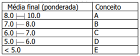
</div>

### **C**

```c
#include <stdio.h>
int main() {

    float nota1, nota2, media;
    char conceito;

    printf("\nCALCULADORA DE NOTAS\n");
    printf("------------------------------\n");

    printf("Digite a primeira nota: ");
    scanf("%f", &nota1);

    printf("Digite a segunda nota: ");
    scanf("%f", &nota2);

    media = (nota1 + nota2) / 2;

    if (media >= 8.0) {
        conceito = 'A';
        } else if (media >= 7.0) {
        conceito = 'B';
        } else if (media >= 6.0) {
        conceito = 'C';
        } else if (media >= 5.0) {
        conceito = 'D';
        } else {
        conceito = 'E';}

    printf("Media final: %.2f\n", media);
    printf("Conceito final: %c\n", conceito);
    printf("------------------------------\n");
    return 0;
}
```

---

## **RESULTADO 11**

<div style="display: flex; flex-direction: row; gap: 25px">
    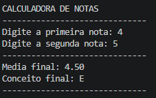
    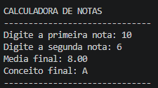
  </div>

<div style="page-break-after: always;"></div>

---

## 12. Custo telefônico

* **Enunciado:** Um município possui um único posto telefônico, na zona rural. Sabe-se que no pequeno posto são feitas todas as ligações interurbanas da cidade. O valor a ser pago é obtido com base nas seguintes regras de cálculo: - Taxa fixa de R$ 2,00 pela ligação e taxa de R$1,00 para os 3 primeiros minutos; - Acima dos três primeiros minutos as regras são de R$1,50 para cada intervalo de 5 minutos e R$ 0,25 para cada minuto abaixo disto. Desenvolva um programa na Linguagem C para receber a quantidade de minutos da ligação e calcule o valor a ser pago com base nas regras acima.

### **C**

```c
#include <stdio.h>

int main() {

    float valor, minutos;
    
    printf("\nCALCULADORA TELEFONICA\n");
    printf("------------------------------\n");

    printf("Digite a duracao da ligacao em minutos: ");
    scanf("%f", &minutos);

    if (minutos <= 3) {
        valor = 2.00 + (1.00 * minutos);
    } else {
        float minutos_excedentes = minutos - 3;
        int intervalos_de_5 = (int)(minutos_excedentes / 5);
        float minutos_restantes = minutos_excedentes - (intervalos_de_5 * 5);

        valor = 2.00 + (1.00 * 3) + (1.50 * intervalos_de_5) + (0.25 * minutos_restantes);
    }

    printf("------------------------------\n");
    printf("Valor a ser pago: R$ %.2f\n", valor);
    printf("------------------------------\n");

    return 0;
}
```

---

## **RESULTADO 12**

<div style="display: flex; flex-direction: row; gap: 25px">
    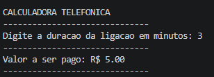
    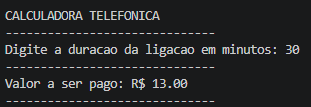
  </div>

<div style="page-break-after: always;"></div>

---

## 13. Check-in Resort de Luxo

* **Enunciado:** Num resort de luxo um dos itens solicitados na hora do check in é o nome do continente de origem do hospede: 1-América do norte; 2-América Central; 3-América do Sul; 4-Europa; 5-Ásia; 6-África; e 7-Oceania. Usando a estrutura switch/case, desenvolva um programa que receba os dados de 20 turistas e no final mostre os totais de cada continente e o percentual de turistas da américa do sul.

### **C**

```c
#include <stdio.h>
#include <stdlib.h>

int main() {
    
    int continente;
    int america_norte = 0, america_central = 0, america_sul = 0, europa = 0, asia = 0, africa = 0, oceania = 0;

    for (int i = 1; i <= 20; i++) {
        system("cls");
        printf("\nCONTAGEM DE TURISTAS POR CONTINENTE\n");
        printf("---------------------------------------------------\n");
        printf("Digite o continente de origem do turista %d/20: \n", i);
        printf("---------------------------------------------------\n");
        printf("1 - America do Norte  | 2 - America Central\n");
        printf("3 - America do Sul    | 4 - Europa\n");
        printf("5 - Asia | 6 - Africa | 7 - Oceania\n");
        printf("---------------------------------------------------\n");
        scanf("%d", &continente);

        switch (continente) {
            case 1:
                america_norte++;break;
            case 2:
                america_central++;break;
            case 3:
                america_sul++;break;
            case 4:
                europa++;break;
            case 5:
                asia++;break;
            case 6:
                africa++;break;
            case 7:
                oceania++;break;
            default:
                i--;break;
        }
    }

    float percentual_america_sul = ((float)america_sul / 20) * 100;

    system("cls");
    printf("\nTOTAL DE TURISTAS POR CONTINENTE:\n");
    printf("---------------------------------------------------\n");
    printf("America do Norte:  %2i | America Central: %2i\n", america_norte, america_central);
    printf("America do Sul:    %2i | Europa:          %2i\n", america_sul, europa);
    printf("Asia: %2i | Africa: %2i | Oceania:         %2i\n", asia, africa, oceania);
    printf("---------------------------------------------------\n");
    printf("Percentual de turistas da America do Sul: %.2f%%\n", percentual_america_sul);
    printf("---------------------------------------------------\n");

    return 0;
}
```

---

## **RESULTADO 13**

<div style="display: flex; flex-direction: row; gap: 25px">
    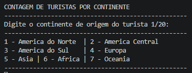
    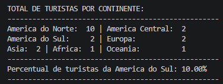
  </div>

<div style="page-break-after: always;"></div>

---

## 14. Categorização de Intervalos Númericos

* **Enunciado:** Usando a estrutura while(), escreva um programa na Linguagem C que leia uma quantidade desconhecida de números e conte quantos deles estão nos seguintes intervalos: [0-25], [26-50], [51-75] e [76-100]. A entrada de dados deve terminar quando for lido um número negativo.

### **C**

```c
#include <stdio.h>
#include <stdlib.h>

int main() {

    int numero;
    int intervalo1 = 0, intervalo2 = 0, intervalo3 = 0, intervalo4 = 0;

    while (1) {
        system("cls");
        printf("\nCONTAGEM DE NUMEROS POR INTERVALO\n");
        printf("------------------------------\n");
        printf("(%i numeros foram digitados ate o momento)\n", intervalo1 + intervalo2 + intervalo3 + intervalo4);
        printf("(digite um numero negativo para encerrar)\n");
        printf("\nDigite os numeros: ", intervalo1 + intervalo2 + intervalo3 + intervalo4);
        scanf("%i", &numero);
        if (numero < 0) {
            break;
        } else if (numero <= 25) {
            intervalo1++;
        } else if (numero <= 50) {
            intervalo2++;
        } else if (numero <= 75) {
            intervalo3++;
        } else if (numero <= 100) {
            intervalo4++;
        }
    }

    system("cls");
    printf("\nCONTAGEM DE NUMEROS POR INTERVALO:\n");
    printf("------------------------------------------------\n");
    printf("Quantidade de numeros no intervalo [0-25]  : %2i\n", intervalo1);
    printf("Quantidade de numeros no intervalo [26-50] : %2i\n", intervalo2);
    printf("Quantidade de numeros no intervalo [51-75] : %2i\n", intervalo3);
    printf("Quantidade de numeros no intervalo [76-100]: %2i\n", intervalo4);
    printf("------------------------------------------------\n");

    return 0;
}
```

---

## **RESULTADO 14**

<div style="display: flex; flex-direction: row; gap: 25px">
    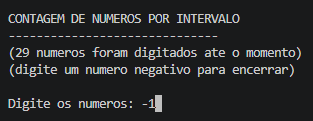
    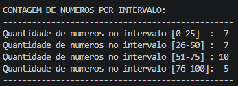
  </div>

<div style="page-break-after: always;"></div>

---

## 15. Mercadorias e Lucro

* **Enunciado:** Desenvolva um programa em linguagem C, usando a estrutura do/while(), para um comerciante que deseja fazer o levantamento diário do lucro das mercadorias que ele comercializa. Para isto, quer registrar cada mercadoria com o nome, preço de compra (preço de custo) e preço de venda das mesmas, em seguida calcule o percentual de lucro em cada mercadoria – veja o exemplo abaixo:

<div align="center">
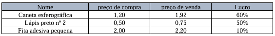
</div>

No final exiba:

* Quantidade de mercadorias com lucro de até 10%;
* Quantidade de mercadorias com lucro acima de 10% até 30%;
* Quantidade de mercadorias com lucro acima de 30% até 50%
* Quantidade de mercadorias com lucro acima de 50%;
* Total de compras (custo total) em R$
* Total de vendas em R$
* Total de lucro em R$

### **C**

```c
#include <stdio.h>
#include <string.h>
#include <stdlib.h>

int main() {

    char nome[50];
    float preco_compra, preco_venda, percentual_lucro, total_compras = 0, total_vendas = 0, total_lucro = 0;
    int mercadorias_ate_10 = 0, mercadorias_10_30 = 0, mercadorias_30_50 = 0, mercadorias_acima_50 = 0;
    
    system("cls");
    
    printf("\nLEVANTAMENTO DIARIO DE LUCRO DAS MERCADORIAS\n");
    printf("-----------------------------------------------------------------------------------\n");

    do {
        printf("Digite o nome da mercadoria %2i (ou 'sair' para encerrar): ", mercadorias_ate_10 + mercadorias_10_30 + mercadorias_30_50 + mercadorias_acima_50 + 1);
        scanf(" %49[^\n]", nome);
        if (strcmp(nome, "sair") == 0 || strcmp(nome, "Sair") == 0) {
            break;
        }
        printf("Digite o preco de compra: ");
        scanf("%f", &preco_compra);
        printf("Digite o preco de venda: ");
        scanf("%f", &preco_venda);
        printf("-----------------------------------------------------------------------------------\n");

        percentual_lucro = ((preco_venda - preco_compra) / preco_compra) * 100;

        if (percentual_lucro <= 10) {
            mercadorias_ate_10++;
        } else if (percentual_lucro <= 30) {
            mercadorias_10_30++;
        } else if (percentual_lucro <= 50) {
            mercadorias_30_50++;
        } else {
            mercadorias_acima_50++;
        }

        total_compras += preco_compra;
        total_vendas += preco_venda;
        total_lucro += (preco_venda - preco_compra);

    } while (1);

    system("cls");
    printf("\nLUCRO DAS MERCADORIAS\n");
    printf("--------------------------------------------------------------\n");
    printf("Quantidade de mercadorias com lucro de ate 10%%:           %2i\n", mercadorias_ate_10);
    printf("Quantidade de mercadorias com lucro acima de 10%% ate 30%%: %2i\n", mercadorias_10_30);
    printf("Quantidade de mercadorias com lucro acima de 30%% ate 50%%: %2i\n", mercadorias_30_50);
    printf("Quantidade de mercadorias com lucro acima de 50%%:         %2i\n", mercadorias_acima_50);
    printf("--------------------------------------------------------------\n");
    printf("\nRESUMO FINANCEIRO\n");
    printf("----------------------------------------\n");
    printf("Total de compras (custo total): R$%5.2f\n", total_compras);
    printf("Total de vendas:                R$%5.2f\n", total_vendas);
    printf("Total de lucro:                 R$%5.2f\n", total_lucro);
    printf("----------------------------------------\n");

    return 0;
}
```

---

## **RESULTADO 15**

<div style="display: flex; flex-direction: row; gap: 15px">
    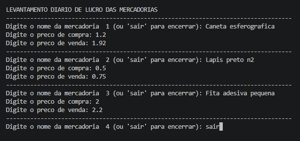
    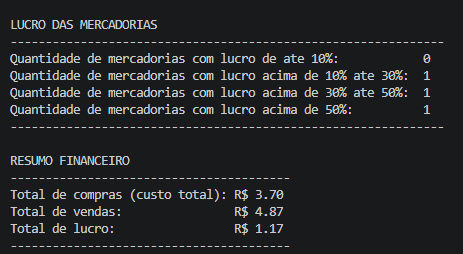
  </div>

<div style="page-break-after: always;"></div>

---

## 16. Pesquisa sobre alturas

* **Enunciado:**  Um instituto de pesquisa entrevistou os habitantes de uma região e foram coletados os dados de altura e sexo (0=masc, 1=fem) das pessoas. Faça um programa em Linguagem C usando o laço for(), que leia 50 dados diferentes e no final informe: a maior e a menor altura encontradas; a média de altura das mulheres; a média de altura da população; o percentual de homens na população. O programa deve solicitar ao usuário se ele deseja repetir o processamento.

### **C**

```c
#include <stdio.h>
#include <stdlib.h>

int main() {
    int conf = 0;

//o valor de "i" é 5 para fins de teste, para não precisar digitar 50 vezes os dados
//o valor de "i" pode ser alterado para 50, no laço for(), para atender ao enunciado da questão
//assim como, o valor de "5" no cálculo da média da população, pode ser alterado para 50, para atender ao enunciado da questão

do{
    float altura, maiorAltura = 0, menorAltura = 0, somaAlturaM = 0, somaAlturaT = 0;
    int sexo, qtdM = 0, qtdH = 0, i;

    system("cls");

    printf("\nCONTAGEM DE ALTURA E SEXO\n");
    
    for (i = 1; i <= 5; i++) {
        printf("---------------------------------------------------\n");
        printf("Digite a altura da pessoa %d/5 em cm:             ", i);
        scanf("%f", &altura);
        printf("Digite o sexo da pessoa %d/5 (0 - masc, 1 - fem): ", i);
        scanf("%i", &sexo);

        if (i == 1) {
            menorAltura = altura;
        }

        if (altura > maiorAltura) {
            maiorAltura = altura;
        }
        if (altura < menorAltura) {
            menorAltura = altura;
        }

        if (sexo == 1) {
            somaAlturaM += altura;
            qtdM++;
        } else if (sexo == 0) {
            qtdH++;
        }

        somaAlturaT += altura;
    }

    system("cls");
    printf("\nRESULTADOS:\n");
    printf("---------------------------------------------------\n");
    printf("Maior altura:                      %3.0fcm\n", maiorAltura);
    printf("Menor altura:                      %3.0fcm\n", menorAltura);
    printf("Media de altura das mulheres:      %3.0fcm\n", (qtdM > 0) ? (somaAlturaM / qtdM) : 0);
    printf("Media de altura da populacao:      %3.0fcm\n", somaAlturaT / 5);
    printf("Percentual de homens na populacao: %3.2f%%\n", ((float)qtdH / 5) * 100);
    printf("---------------------------------------------------\n");

    printf("\nDeseja repetir o processamento? (1 - Sim, 0 - Nao): ");
    scanf("%i", &conf);

    }while (conf == 1);

    return 0;
}
```

<div style="page-break-after: always;"></div>

---

## **RESULTADO 16**

<div style="display: flex; flex-direction: row; gap: 25px">
    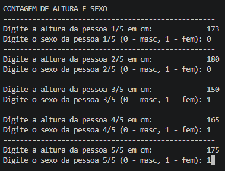
    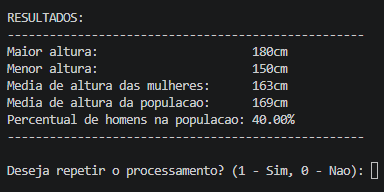
  </div>
