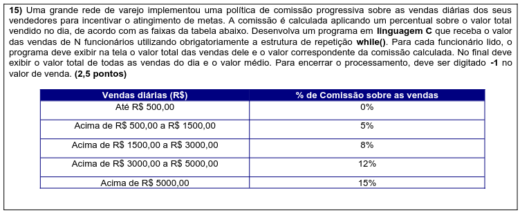
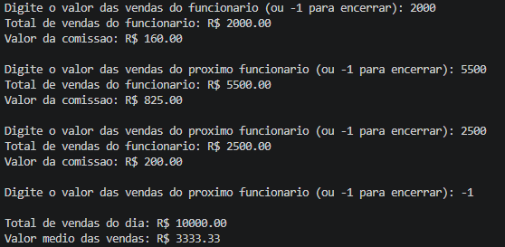
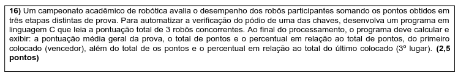
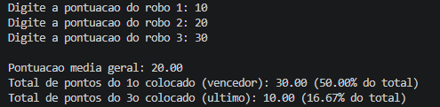

# ALGORITMO B

KAUAN ANDRADE SILVA - SP3307174 - 22/09

---

## 15. COMISSÕES



### CÓDIGO

```C
#include <stdio.h>

int main() {
    float venda, comissao_pct, valor_comissao;
    float total_vendas = 0.0;
    int qtd_funcionarios = 0;

    printf("Digite o valor das vendas do funcionario (ou -1 para encerrar): ");
    scanf("%f", &venda);

    while (venda != -1) {
        if (venda <= 500.0) {
            comissao_pct = 0.0;
        } else if (venda <= 1500.0) {
            comissao_pct = 5.0;
        } else if (venda <= 3000.0) {
            comissao_pct = 8.0;
        } else if (venda <= 5000.0) {
            comissao_pct = 12.0;
        } else {
            comissao_pct = 15.0;
        }

        valor_comissao = venda * (comissao_pct / 100.0);
        printf("Total de vendas do funcionario: R$ %.2f\n", venda);
        printf("Valor da comissao: R$ %.2f\n\n", valor_comissao);

        total_vendas += venda;
        qtd_funcionarios++;

        printf("Digite o valor das vendas do proximo funcionario (ou -1 para encerrar): ");
        scanf("%f", &venda);
    }

    if (qtd_funcionarios > 0) {
        printf("\nTotal de vendas do dia: R$ %.2f\n", total_vendas);
        printf("Valor medio das vendas: R$ %.2f\n", total_vendas / qtd_funcionarios);
    } else {
        printf("\nNenhum dado foi digitado.\n");
    }

    return 0;
}
```

<div style="page-break-after: always;"></div>

## RESULTADO



<div style="page-break-after: always;"></div>

## 16. ROBÓTICA



## CÓDIGO

```C
#include <stdio.h>

int main() {
    float r1, r2, r3;
    float total, media, p_primeiro, p_terceiro;

    printf("Digite a pontuacao do robo 1: ");
    scanf("%f", &r1);
    printf("Digite a pontuacao do robo 2: ");
    scanf("%f", &r2);
    printf("Digite a pontuacao do robo 3: ");
    scanf("%f", &r3);

    total = r1 + r2 + r3;
    media = total / 3.0;

    float primeiro, terceiro;

    if (r1 >= r2 && r1 >= r3) {
        primeiro = r1;
        terceiro = (r2 < r3) ? r2 : r3;
    } else if (r2 >= r1 && r2 >= r3) {
        primeiro = r2;
        terceiro = (r1 < r3) ? r1 : r3;
    } else {
        primeiro = r3;
        terceiro = (r1 < r2) ? r1 : r2;
    }

    p_primeiro = (primeiro / total) * 100;
    p_terceiro = (terceiro / total) * 100;

    printf("\nPontuacao media geral: %.2f\n", media);
    printf("Total de pontos do 1o colocado (vencedor): %.2f (%.2f%% do total)\n", primeiro, p_primeiro);
    printf("Total de pontos do 3o colocado (ultimo): %.2f (%.2f%% do total)\n", terceiro, p_terceiro);

    return 0;
}
```

<div style="page-break-after: always;"></div>

## RESULTADO


