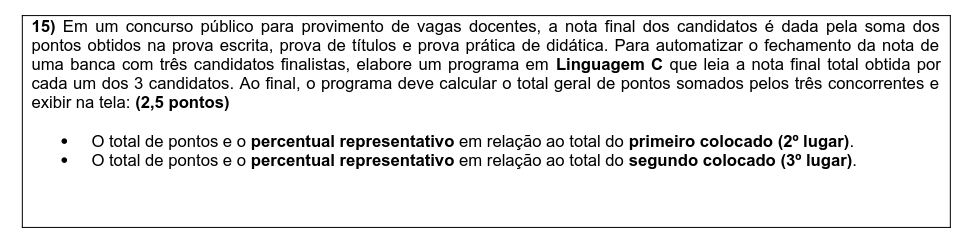
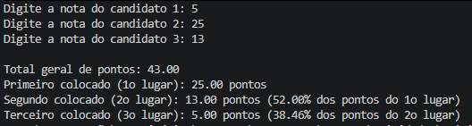
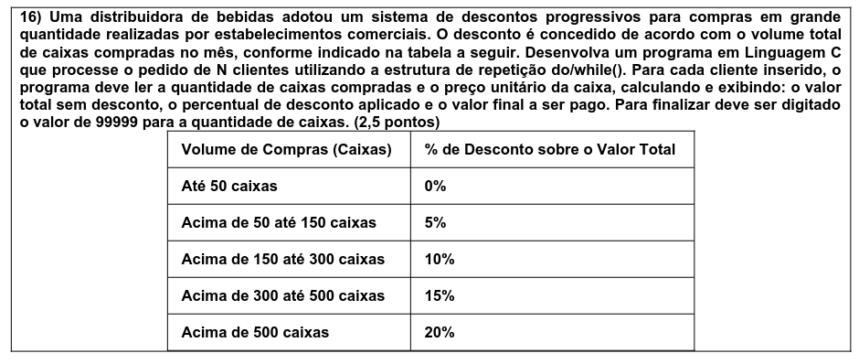
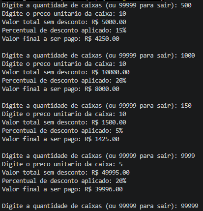

# ALGORITMO B

KAUAN ANDRADE SILVA - SP3307174 - 22/09

---

## 15. CANDIDATOS



### CÓDIGO

```C
#include <stdio.h>

int main() {
    float n1, n2, n3;
    float total, p_segundo, p_terceiro;
    float primeiro, segundo, terceiro;

    printf("Digite a nota do candidato 1: ");
    scanf("%f", &n1);
    printf("Digite a nota do candidato 2: ");
    scanf("%f", &n2);
    printf("Digite a nota do candidato 3: ");
    scanf("%f", &n3);

    total = n1 + n2 + n3;

    if (n1 >= n2 && n1 >= n3) {
        primeiro = n1;
        if (n2 >= n3) {
            segundo = n2;
            terceiro = n3;
        } else {
            segundo = n3;
            terceiro = n2;
        }
    } else if (n2 >= n1 && n2 >= n3) {
        primeiro = n2;
        if (n1 >= n3) {
            segundo = n1;
            terceiro = n3;
        } else {
            segundo = n3;
            terceiro = n1;
        }
    } else {
        primeiro = n3;
        if (n1 >= n2) {
            segundo = n1;
            terceiro = n2;
        } else {
            segundo = n2;
            terceiro = n1;
        }
    }

    p_segundo = (segundo / primeiro) * 100;
    p_terceiro = (terceiro / segundo) * 100;

    printf("\nTotal geral de pontos: %.2f\n", total);
    printf("Primeiro colocado (1o lugar): %.2f pontos\n", primeiro);
    printf("Segundo colocado (2o lugar): %.2f pontos (%.2f%% dos pontos do 1o lugar)\n", segundo, p_segundo);
    printf("Terceiro colocado (3o lugar): %.2f pontos (%.2f%% dos pontos do 2o lugar)\n", terceiro, p_terceiro);

    return 0;
}
```

<div style="page-break-after: always;"></div>

## RESULTADO



<div style="page-break-after: always;"></div>

## 16. COMPRA DE CAIXAS



## CÓDIGO

```C
#include <stdio.h>

int main() {
    int caixas;
    float preco_unitario, total_sem_desconto, percentual_desconto, valor_desconto, valor_final;

    do {
        printf("Digite a quantidade de caixas (ou 99999 para sair): ");
        scanf("%d", &caixas);

        if (caixas == 99999) {
            break;
        }

        printf("Digite o preco unitario da caixa: ");
        scanf("%f", &preco_unitario);

        if (caixas <= 50) {
            percentual_desconto = 0.0;
        } else if (caixas <= 150) {
            percentual_desconto = 5.0;
        } else if (caixas <= 300) {
            percentual_desconto = 10.0;
        } else if (caixas <= 500) {
            percentual_desconto = 15.0;
        } else {
            percentual_desconto = 20.0;
        }

        total_sem_desconto = caixas * preco_unitario;
        valor_desconto = total_sem_desconto * (percentual_desconto / 100.0);
        valor_final = total_sem_desconto - valor_desconto;

        printf("Valor total sem desconto: R$ %.2f\n", total_sem_desconto);
        printf("Percentual de desconto aplicado: %.0f%%\n", percentual_desconto);
        printf("Valor final a ser pago: R$ %.2f\n\n", valor_final);

    } while (1);

    return 0;
}
```

<div style="page-break-after: always;"></div>

## RESULTADO


