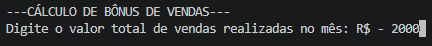
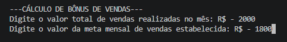
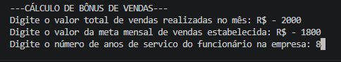
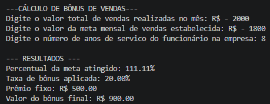

<!-- markdownlint-disable MD033 -->

# Atividade 9 SPOLOG1 (25/08/2026)

**Aluno:** Kauan Andrade Silva  
**Professor:** Francisco Luciano

---

## 9. Calcular Bônus de Vendas

* **Enunciado:** Uma empresa deseja conceder benefícios e incentivos para os seus funcionários do departamento de vendas, de acordo com alguns critérios estabelecidos pela gerência. Dessa forma, escreva um programa na linguagem C, que leia **3 dados** de entrada de um funcionário:

1. **Valor total de vendas** realizadas no mês
2. **Valor da meta mensal de vendas** estabelecida
3. **Número de anos de serviço** do funcionário na empresa

O programa deve realizar os seguintes cálculos e decisões encadeadas:

* Calcular o **percentual da meta atingido**:
  `percentual_atingido = (Vendas / Meta) * 100`
* Definir o percentual da **taxa de bônus**, a partir do **percentual atingido**:
  * Se atingiu **menos de 80%** da meta -> **Sem bônus** (0%).
  * Se atingiu **entre 80% e 99.9%** da meta -> Bônus de **5%** sobre o valor vendido.
  * Se atingiu **100% ou mais** da meta:
    * Se tiver **menos de 3 anos** de empresa -> Bônus de **10%** sobre as vendas.
    * Se tiver **entre 3 e 5 anos** de empresa -> Bônus de **15%** sobre as vendas.
    * Se tiver **mais de 5 anos** de empresa -> Bônus de **20%** sobre as vendas + um **prêmio fixo** de **R$ 500,00**.

No final, o programa deve exibir:

* O percentual da meta atingido
* A taxa de bônus aplicada
* O prêmio fixo
* O valor total do bônus final a receber -> (vendas * taxa de bônus) + prêmio fixo

<div style="page-break-inside: avoid;">

### **C**

```C
#include <stdio.h>
#include <windows.h>

int main() {
    
    SetConsoleOutputCP(65001);

    float vendas, meta, percentual_atingido, taxBonus = 0.0, premio = 0.0, bonusFinal;
    int anos_servico;

    printf("\n---CÁLCULO DE BÔNUS DE VENDAS---\n");
    printf("Digite o valor total de vendas realizadas no mês: R$ - ");
    scanf("%f", &vendas);
    printf("Digite o valor da meta mensal de vendas estabelecida: R$ - ");
    scanf("%f", &meta);
    printf("Digite o número de anos de servico do funcionário na empresa: ");
    scanf("%d", &anos_servico);

    percentual_atingido = (vendas / meta) * 100.0;

    if (percentual_atingido < 80.0) {
        taxBonus = 0.0;
        premio = 0.0;
    } else if (percentual_atingido <= 99.9) {
        taxBonus = 0.05;
        premio = 0.0;
    } else {
        if (anos_servico < 3) {
            taxBonus = 0.10;
            premio = 0.0;
        } else if (anos_servico <= 5) {
            taxBonus = 0.15;
            premio = 0.0;
        } else {
            taxBonus = 0.20;
            premio = 500.0;
        }
    }
    bonusFinal = (vendas * taxBonus) + premio;

    printf("\n--- RESULTADOS ---\n");
    printf("Percentual da meta atingido: %.2f%%\n", percentual_atingido);
    printf("Taxa de bônus aplicada: %.2f%%\n", taxBonus * 100.0);
    printf("Prêmio fixo: R$ %.2f\n", premio);
    printf("Valor do bônus final: R$ %.2f\n", bonusFinal);

    return 0;
}
```

</div>

---

<div align="center">

## **RESULTADO 9**

<div style="display: flex; flex-direction: column; gap: 25px; align-items: center">
  <div style="display: flex; gap: 10px;">
    
  </div>
  <div style="display: flex; gap: 10px;">
    
  </div>
  <div style="display: flex; gap: 10px;">
    
  </div>
  <div style="display: flex; gap: 10px;">
    
  </div>
</div>

</div>
