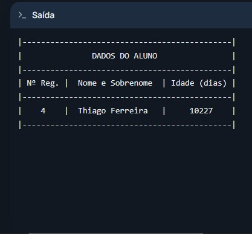

<!-- markdownlint-disable MD033 -->
<!-- markdownlint-disable MD041 -->
</style>

<div style="page-break-inside: avoid;">

# Atividades SPOLOG1 (18/08 - 24/08)

**Aluno:** Kauan Andrade Silva  
**Professor:** Francisco Luciano

---

## 5. Dados de Alunos

* **Enunciado:** Desenvolver um algoritmo (diagrama de blocos e portugol) – usando a estrutura ESCOLHA/CASO,  leia o número do registro de um aluno e escreva o respectivo nome do aluno e sua idade em dias, a partir do quadro abaixo:

<div align="center">
  
</div>

### **Versão em Portugol**

```portugol
algoritmo "Dados de Alunos - Simplificado"
// Disciplina: Lógica de Programação 1
// Descrição: Desenvolver um algoritmo (diagrama de blocos e portugol) – usando a
// estrutura ESCOLHA/CASO,  leia o número do registro de um aluno e escreva o
// respectivo nome do aluno e sua idade em dias.
// Autor: Kauan Andrade
// Data: 23/08/2026
var
   reg, iAnos, iDias: inteiro
   nome: caractere
   valido: logico
inicio
  Escreval("|--------------------------------|")
  Escreval("|        ALUNOS REGISTRADOS      |")
  Escreval("|--------------------------------|")
  Escreval("|  1 - Luiz S.  |  2 - Carlos S. |")
  Escreval("|--------------------------------|")
  Escreval("|  3 - Ana O.   |  4 - Thiago F. |")
  Escreval("|--------------------------------|")
  Escreval()
  Escreval("Digite o registro do aluno para mais dados:")
    Leia(reg)
    limpatela
    valido <- verdadeiro
    escolha (reg)
      caso 1
         nome <- "   Luiz Silva   "
         iAnos <- 15
      caso 2
         nome <- "  Carlos Santos "
         iAnos <- 19
      caso 3
         nome <- "  Ana Oliveira  "
         iAnos <- 25
      caso 4
         nome <- "Thiago Ferreira "
         iAnos <- 28
      outrocaso
         valido <- falso
         Escreval("O número informado não corresponde a nenhum registro!")
    fimescolha
      se (valido) entao
        iDias <- (iAnos * 365) + (iAnos div 4)
          Escreval("|---------------------------------------------|")
          Escreval("|               DADOS DO ALUNO                |")
          Escreval("|---------------------------------------------|")
          Escreval("| Nº Reg. |  Nome e Sobrenome  | Idade (dias) |")
          Escreval("|---------------------------------------------|")
          Escreval("|    ", reg, "    |  ", nome, "  |     ", iDias:5:0, "    |")
          Escreval("|---------------------------------------------|")
      fimse
fimalgoritmo
```

</div>

---

### **RESULTADO**

<div style="display: flex; gap: 10px;">
  
  
</div>

---

<div style="page-break-inside: avoid;">

### **Versão em Fluxograma**

<div align="center">
  
</div>

---

</div>

<div style="page-break-inside: avoid;">

## 6. Calculadora de Média Aritmética e Contagem de Números

* **Enunciado:** Desenvolver um algoritmo (PORTUGOL) – usando o laço PARA,  que leia a quantidade 1de N valores,  calcule e escreva: A. Média aritmética dos valores lidos; B. Quantidade e o percentual de valores positivos; C. Quantidade e o percentual de valores negativos.

```portugol
algoritmo "Calculadora de Média Aritmética e Contagem de Números"
// Disciplina: Lógica de Programação 1
// Descrição: Desenvolver um algoritmo (PORTUGOL) – usando o laço PARA,  que leia a quantidade 1de N valores,  calcule e escreva: A. Média aritmética dos valores lidos; B. Quantidade e o percentual de valores positivos; C. Quantidade e o percentual de valores negativos.
// Autor: Kauan Andrade
// Data: 23/08/2026

var


inicio

fimalgoritmo
```

</div>

---

<div style="page-break-inside: avoid;">

## 7. Soma a Partir de N

* **Enunciado:** Escreva um algoritmo (portugol) usando a estrutura enquanto/faça, para ler um valor A e um valor N. Imprimir a soma dos N números a partir de A (inclusive). Caso N seja negativo ou ZERO, deverá ser lido um novo N (apenas N). Veja na tabela a seguir algumas entradas para teste:

<div align="center">
  
</div>

```portugol
algoritmo "Soma a Partir de N"
// Disciplina: Lógica de Programação 1
// Descrição: Escreva um algoritmo (portugol) usando a estrutura enquanto/faça, para ler um valor A e um valor N. Imprimir a soma dos N números a partir de A (inclusive). Caso N seja negativo ou ZERO, deverá ser lido um novo N (apenas N).
// Autor: Kauan Andrade
// Data: 23/08/2026

var


inicio

fimalgoritmo
```

</div>

---

<div style="page-break-inside: avoid;">

## 8.  Análise de Números Inteiros

* **Enunciado:** Construa um algoritmo (diagrama de blocos), usando FAÇA/ENQUANTO,  que leia uma quantidade indeterminada de números inteiros positivos e no final mostre: A. O maior número digitado; B. O menor número digitado; C. A quantidade de vezes que o primeiro número é digitado. O final da série de números digitada deve ser indicado pela entrada de -1.

```portugol
algoritmo "Análise de Números Inteiros"
// Disciplina: Lógica de Programação 1
// Descrição: Construa um algoritmo (diagrama de blocos), usando FAÇA/ENQUANTO,  que leia uma quantidade indeterminada de números inteiros positivos e no final mostre: A. O maior número digitado; B. O menor número digitado; C. A quantidade de vezes que o primeiro número é digitado. O final da série de números digitada deve ser indicado pela entrada de -1. 
// Autor: Kauan Andrade
// Data: 23/08/2026

var


inicio

fimalgoritmo
```

</div>
